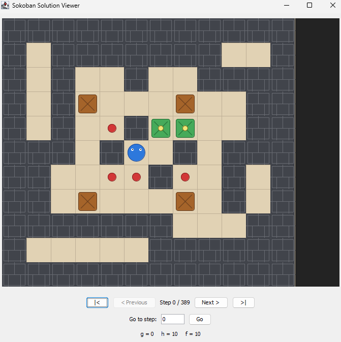
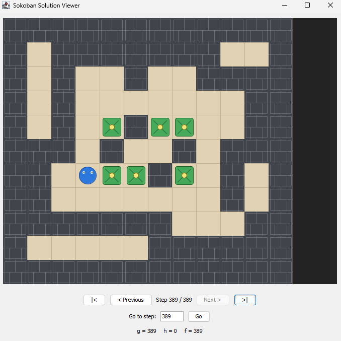
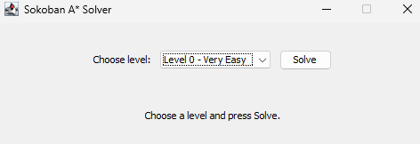

## Symbol Mappings

The following symbols are used internally to represent the different Sokoban tiles. In the Swing interface, each symbol is displayed using a graphical tile.

<table>
  <thead>
    <tr>
      <th align="center">Tile</th>
      <th align="center">Symbol</th>
      <th align="left">Meaning</th>
    </tr>
  </thead>
  <tbody>
    <tr>
      <td align="center">
        
      </td>
      <td align="center"><code>1</code></td>
      <td>Player</td>
    </tr>
    <tr>
      <td align="center">
        
      </td>
      <td align="center"><code>0</code></td>
      <td>Box</td>
    </tr>
    <tr>
      <td align="center">
        
      </td>
      <td align="center"><code>#</code></td>
      <td>Wall</td>
    </tr>
    <tr>
      <td align="center">
        
      </td>
      <td align="center"><code>$</code></td>
      <td>Target</td>
    </tr>
    <tr>
      <td align="center">
        
      </td>
      <td align="center"><code>*</code></td>
      <td>Box on Target</td>
    </tr>
    <tr>
      <td align="center">
        
      </td>
      <td align="center"><code>+</code></td>
      <td>Player on Target</td>
    </tr>
  </tbody>
</table>

A box placed correctly on a target is displayed using a different color, making completed target positions easier to identify.

## File Structure

* **Main.java**
  Entry point of the application. Initializes the Swing interface and stores the movement directions used by the solver.

* **AstarAlgorithm.java**
  Implements the core A* search algorithm. It validates the selected level, explores the available states, detects the goal state, and reconstructs the final solution path.

* **SolveResult.java**
  Encapsulates the result produced by the A* solver. It stores whether a solution was found, the solution path, the execution time, the number of visited states, and an appropriate status message.

* **LevelSelectionFrame.java**
  Provides the initial Swing window used to select a Sokoban level and start the solver. The search runs through a `SwingWorker`, preventing the user interface from freezing while the algorithm is executing.

* **SokobanSolutionViewer.java**
  Displays the complete solution path in a graphical Swing interface. It allows the user to navigate between steps, move directly to a specific step, and inspect the corresponding `g`, `h`, and `f` values.

* **BoardUtils.java**
  Provides utility methods for board manipulation, including move validation, board updates, player localization, state copying, goal checking, and board preprocessing.

* **DeadlockDetector.java**
  Implements deadlock detection techniques, such as corner and corridor deadlocks. These checks eliminate unsolvable states and significantly reduce the search space.

* **GameLevels.java**
  Stores the predefined Sokoban levels used for testing and evaluation.

* **HeuristicEvaluator.java**
  Implements the heuristic function used by A*. It combines the Manhattan distance between boxes and targets with an IDS-based estimation of the player's distance to the nearest reachable box.

* **Node.java**
  Represents a single search state. Each node stores the board configuration, player position, path cost (`g`), heuristic value (`h`), evaluation value (`f`), and a parent reference used for solution reconstruction.

---

## Heuristic Function

The heuristic used by the A* algorithm consists of two components:

**h(n) = h₁(n) + h₂(n)**

where:

* **h₁(n)** is the sum of the minimum Manhattan distance between each box and its nearest target.
* **h₂(n)** is the distance from the player to the nearest reachable box, estimated using Iterative Deepening Search.

The complete heuristic is:

**h(n) = Σ min(ManhattanDistance(Boxᵢ, Targetⱼ))

* IDS(Player, NearestBox)**

This heuristic combines box-to-target proximity with player accessibility, producing a more informed estimate of the remaining effort required to solve the puzzle.

---

## Why IDS Instead of BFS or DFS?

The `IDSPlayertobox(...)` method estimates the distance between the player and the nearest reachable box using **Iterative Deepening Search (IDS)**.

Breadth-First Search explores states level by level and guarantees the shortest path in an unweighted search space. However, it must keep the current search frontier in memory.

For branching factor **b** and solution depth **d**, BFS requires:

* **Time Complexity:** O(bᵈ)
* **Space Complexity:** O(bᵈ)

In Sokoban, the search space can become extremely large, making BFS memory-intensive.

Depth-First Search requires significantly less memory:

* **Time Complexity:** O(bᵈ)
* **Space Complexity:** O(bd)

However, DFS is not guaranteed to find the shortest path and may explore deep, irrelevant branches before reaching a nearby box.

IDS combines important properties of both approaches:

* **Time Complexity:** O(bᵈ)
* **Space Complexity:** O(bd)
* Finds the shallowest solution in an unweighted search space.
* Requires memory proportional to the current search depth.

IDS repeatedly performs depth-limited searches using limits `0, 1, 2, ...` until a reachable box is found. Because shallower depths are examined first, the first successful result represents the shortest player-to-box distance, similarly to BFS.

Although IDS revisits states during successive iterations, its overall asymptotic running time remains O(bᵈ). In practice, the additional overhead is limited because many branches are quickly rejected due to walls, invalid moves, and unreachable positions.

Therefore, IDS provides an accurate player-to-box distance estimate while maintaining low memory consumption, making it suitable for Sokoban environments with rapidly growing search spaces.

---

## Swing User Interface

The application includes a graphical interface implemented using the **Java Swing framework**.

The interface is separated into two main windows:

1. **Level Selection Window**
   Allows the user to choose one of the predefined Sokoban levels and start the A* solver.

2. **Solution Viewer**
   Displays every state in the final solution path and provides controls for:

   * Moving to the previous or next step.
   * Moving directly to the first or final step.
   * Entering a specific step number.
   * Viewing the `g`, `h`, and `f` values of the current state.

The A* search is executed using a `SwingWorker`, ensuring that the interface remains responsive while difficult levels are being solved.

Boxes placed successfully on targets are displayed using a different color, making completed target positions easier to identify.

---

### Example: Sokoban Hard Level Solution Using A*

The following images illustrate the execution of the **A*** search algorithm on a hard Sokoban level.

#### Initial State — Step 0

At the beginning of the search:

* The heuristic value is `h = 10`.
* The path cost is `g = 0`.
* The total evaluation value is `f = 10`.
* The player, boxes, walls, and targets are displayed using the predefined symbol mappings.

  

#### Final State — Step 389

At the final state:

* All boxes have been successfully placed on distinct targets.
* The heuristic value has reached `h = 0`.
* The path cost is `g = 389`.
* The total evaluation value is `f = 389`.

  

This example demonstrates:

* The effectiveness of the A* algorithm on a complex Sokoban configuration.
* The gradual reduction of the heuristic value until the goal state is reached.
* The use of deadlock detection to avoid invalid or unsolvable states.
* The reconstruction and visualization of a solution containing 389 moves.
* A total solving time of approximately 18 seconds for the tested hard level.

## How to Run

1. Run the `Main` class.
2. Select one of the available Sokoban levels from the drop-down menu.
3. Click **Solve** to start the A* search.

  

4. Wait for the search to complete. The solution viewer will open automatically when a solution is found.
5. Use the navigation controls to move through the solution step by step or jump directly to a specific step.

